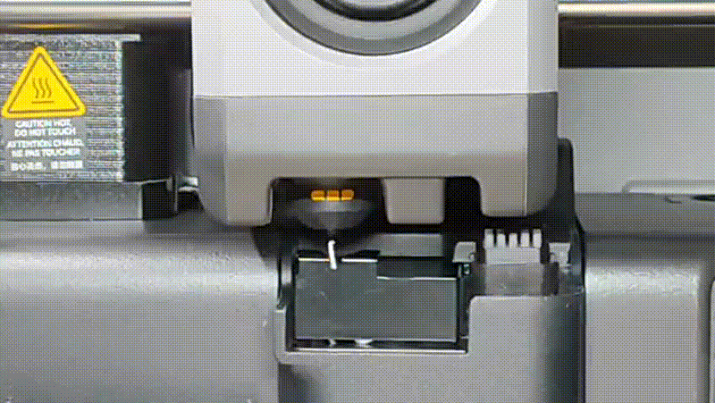
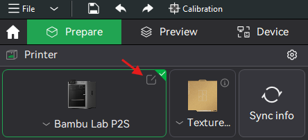
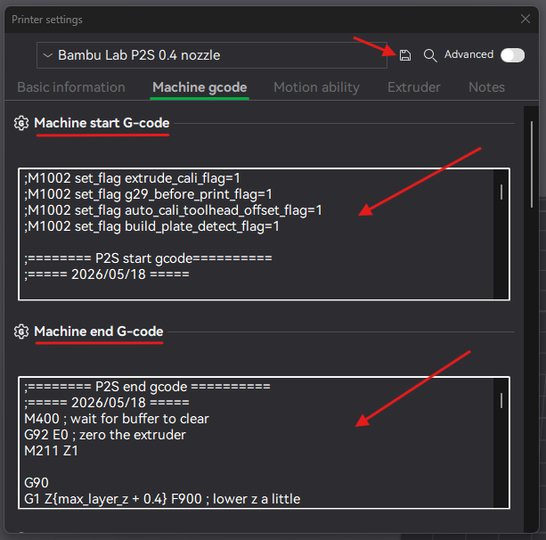

# P2S Optimized G-code

## TL;DR

The P2S is great but its print start and end routines are flawed.

#### Start code improvements

- Improved nozzle cleaning
- More quiet initialization
- Remove some redundancies
- Improve speed and reliability

#### Stop code improvements:

- Clean nozzle finish
- No unloading filament

## Showcase

### Original (before)

### Optimized (after)

## Disclaimer

> ⚠️ USE AT YOUR OWN RISK!
>
> This custom G-code is provided "as-is" without any warranties of safety or compatibility. This script has been tested to work with PLA and PETG - other materials such as engineering and high-temperature filaments have NOT been tested and therefore may be cause problems.
>
> By executing this script, you accept full responsibility for any outcomes. The author assumes no liability for hardware damage (such as nozzle crashes or heater failures), financial losses, or personal injuries resulting from the use or modification of this code.
>
> Before running this script, you must manually verify that the commands match your specific printer model, firmware version, and hardware setup. Always remain by your machine's physical power switch during the initial execution to abort immediately if necessary.

## Why change anything?

I really like the P2S but have always felt like it is not performing on the level that it could be. In comparison to the A1 (and mini especially) it feels less refined and clunky, almost as if its release was a bit rushed by Bambu Lab. And they did not continue to optimize and fix issues after the initial release.

This includes the printer being very noisy during its startup routine and unnecessary movements, homing procedures etc.

Worst of all - and the main reason for me to start optimizing the start code - being the excessive and useless nozzle wiping that never seems to really get the nozzle clean.

**Exhibit A:** This [YouTube Video](https://www.youtube.com/shorts/HUE2p0dOb1Q) demonstrates the issue quite well (not my video btw).

## What was optimized?

This optimized G-code focuses on fixing issues while the overall structure and process that Bambu Lab intended are kept intact.

The intention being that the procedure is still robust and safe and not targeted towards ultimate speed or certain edge cases that require manual intervention.

Secondly since the original start code is updated periodically, I want to easily integrate official changes (like exhaust fan kit, ventobox, filament manager, ...).

### Start code

- **Nozzle heating:** Add non-blocking pre-heating to 140 °C at start to speed things up.

- **Decreased Z-movement:** Default is huge (+22/-12) and has been reduced (+5/-2).

- **Decreased acceleration:** Acceleration during initialization was 10.000 mm/s² which is quite abrupt and not really necessary during startup and has therefore been reduced to 5.000 mm/s². (Acceleration defined in the slicer is still used at print start.)

- **Enable input shaping:** Motor noise suppression was enabled before turning on input shaping, therefore having no effect and being the reason why startup sequence was louder than it needed to be. (Source: https://www.reddit.com/r/BambuLab/comments/1s8kneu/p2s_quirks_and_poorly_optimized_firmware_settings/)

- **ℹ️ Nozzle wiping:**
  - **⭕ The problem:** During/after filament purge and optional extruder calibration filament poop is ejected and nozzle is wiped multiple times. Yet with the nozzle still being hot filament continues to ooze out - sticking to the nozzle (and we can't change that since it's baked into firmware).
  - **✅ The fix:** A little extra filament is being pushed through the nozzle, cooling fan is activated while waiting for the nozzle to reach a lower temperature (currently 170 °C). By doing the purge flick, the cooled down filament is removed from the nozzle without oozing of more filament. Then regular nozzle scraping on the little metal plate is performed.

- **Disabled vibration calibration:** Full vibration compensation can and should be performed from the menu every time the printer is moved to a different location (and after firmware updates or maintenance). The very short but loud burst of what is called 'mech mode sweep' in the official G-code imho serves no purpose and is therefore removed.

- **Pre-homing:** Before bed leveling another homing performed. To speed up the process the print head is moved near the XY=0 position where the *endstops* are.

- **Print start:** Before nozzle heating, which by default is done over the poop chute, the build plate is lowered and the print head is moved to the very front of the build plate. This serves two purposes:
  - The nozzle is not moved over the build plate when it is hot, potentially drooping filament onto the build plate.
  - Giving **me** a couple of seconds to remove filament from the nozzle with some tweezers. (Disclaimer: **You** should of course **not** have your hands anywhere inside the printer while it's operating. Leaving the door closed is advised.)

- **Load line:** During final heating of the nozzle some filament may start oozing out (this is normal and does not need to be removed manually). To build up pressure the purge line length is increased.

- Actual print start

### End/Stop code

> **ℹ️ Filament is NOT UNLOADED after printing.**
>
> The default behaviour of any Bambu Lab printer is that after printing the filament is unloaded (when using an AMS). However often times we want to continue printing using the same filament. Therefore with the custom end G-code this behaviour is changed and the filament **intentionally** is not unloaded - which speeds up consecutive prints (and is less noisy).
>
> If you want to use a different filament next that's fine! The printer will automatically change the filament at the start of the print.
>
> If you do however want the filament to be unloaded after a print, you may explicitely write `UnloadFilament=1` in the "Notes" field (settings tab "Others" in BambuStudio).

**In order (from top to bottom):**

- **Stop move:** First priority is moving the nozzle away from the print and close to the purge bin before anything else.

- **Keep or unload filament:** See explanation above.

- **Clean nozzle:** If filament is not unloaded, the same nozzle cleaning as in the start code is applied: A little filament is extruded, cooled down and flicked off so the nozzle stays clean for the next print.

### Other changes

- **Added comments:** Most of the G-code now has comments to easily understand what is going on. Comments of instructions that appear multiple times in the script have been unified. Added custom comments start with `;;` instead of `;` for distinction. (Some proprietary codes are still unknown and therefore remain unchanged or received some question marks `???`.)

- **Formatting:** Whitespaces have been cleaned up, indentation was improved, comments for sections have been added and new lines were added for better structur and orientation.

## How to install

> **ℹ️ Hint:** You can switch between the default and optimized printer profile any time you like.

### Step 1

- Start BambuStudio

- Hover your mouse over where it shows your P2S in the top left corner

- Click the appearing edit icon

### Step 2

- New dialog pops up

- Go to "Machine G-code" tab

- Copy and paste contents of [start.gcode](optimized/start.gcode) into first field

- Copy and paste contents of [stop.gcode](optimized/stop.gcode) into second field

- Before closing the dialog click save icon in the top right

- Enter something like "P2S 0.4 - optimized"

- Close dialog

**🎉 You now have a new printer, that does things a little better!**

## Performance benchmark

### Prerequsites

- White Elegoo Matte PLA (high flush volume)
- Filament already loaded for all tests(*)
- Model: 80 mm cube
- Timer starts at first bed movement
- Time stops at end of nozzle load line

### Measurements

| Profile   | Flow calibration   | Bed leveling  | Time  |
|-----------|--------------------|---------------|-------|
| original  | no                 | no            | 05:18 |
| original  | yes                | yes           | 06:45 |
| optimized | no                 | no            | 04:45 |
| optimized | yes                | yes           | 06:02 |

The optimized code is a bit faster and starts with a clean nozzle and no filament on the bed (which is the main benefit).

(*) Keep in mind that the optimized code by default does not unload the filament after a print therefore consecutive prints with the same filament can start faster. Filament loading delay would be added to the measured times of the original profile.

## Repository layout

The folder `optimized` contains all G-codes that have been improved and should be used for a better experience.

The folder `original` contains current versions of the official G-codes by Bambu Lab. These are thought to be updated from time to time to track changes that were made as well as serve as means to compare the optimized G-codes to the default ones.

(The `assets` folder just contains images from the showcase of this readme.)

## Final thoughts

I initially created this G-code for myself so that I can fully enjoy the printer and get rid of the annoying quirks that otherwise taint the experience for me. I use it every single print.

> **ℹ️ Hint:** If you want your P2S to be more quiet, I also recommend reducing all accelerations of 10000 mm/s² to 6000 mm/s² in the slicer. This adds very little extra time to your prints but makes the printer operate much more quiet and stops it shaking violently.

**If you have any questions or encounter problems don't hesitate to reach out!**
